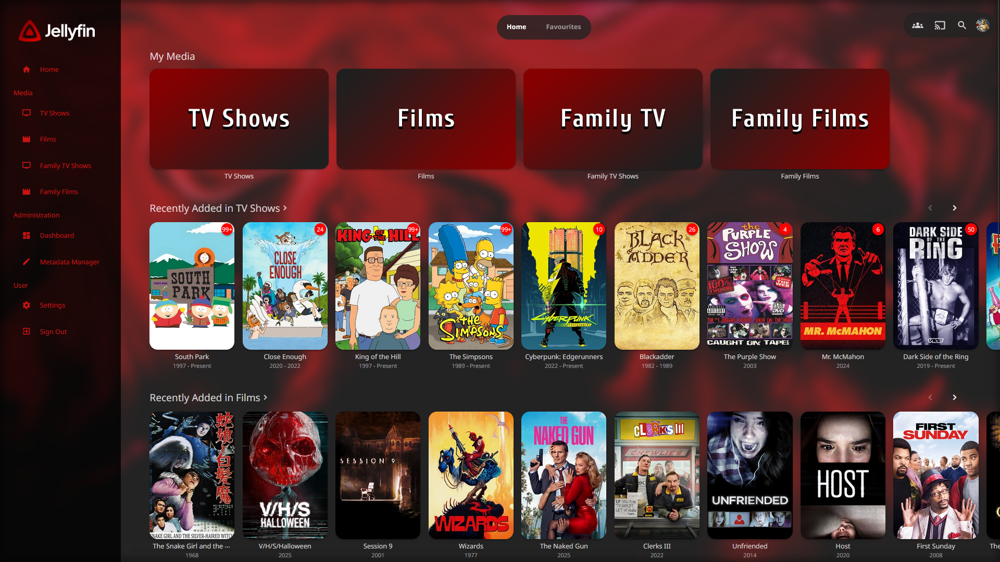
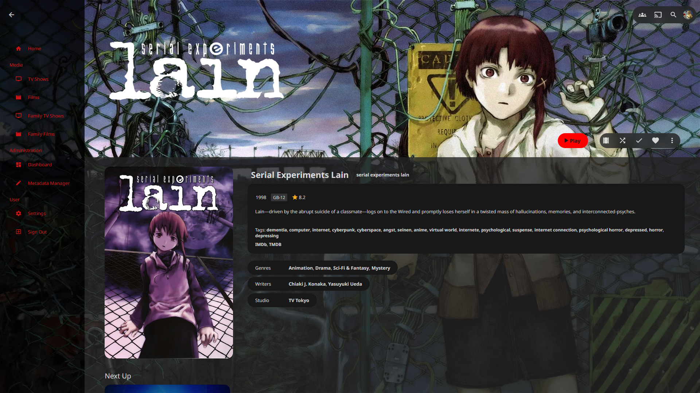

<p align="center">
  
</p>

### **StrawberryJam**
The Jellyfin theme for red enthusiasts. Supports banners

[Go to installation](#installation)

---

### **Import URL**
Jellyfin 10.11.X and above
```
@import url('https://cdn.jsdelivr.net/gh/KnuXles/StrawberryJam@main/StrawberryJam.css');
```




---

### **Installation:**

**Server-wide install:**
* Click the hamburger icon (Top left)
* Navigate to "Dashboard" (ensure you are signed in to your admin account)
* Navigate to "Branding"
* In the "Custom CSS code" box, paste the `@import url` from the section above
* Click "Save"

---

**Single client install:**
* Click the hamburger icon (Top left)
* Navigate to "Settings"
* Navigate to "Display"
* In the "Custom CSS code" box, paste the `@import url` from the section above
* Click "Save"
